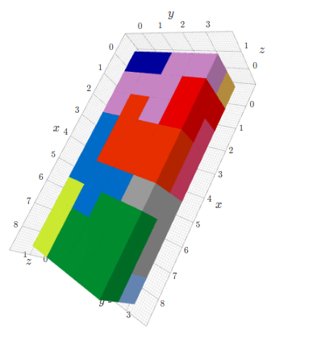
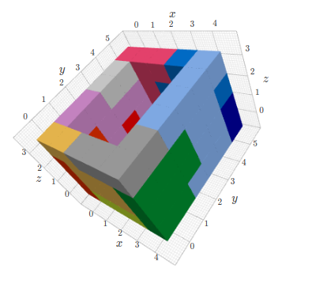

# Dogpiler

Recursive brute-force solver for the game [Dogpile](https://www.brainwright.com/products/display/8310).

Also exploring Python 3.9 type hints.

3D visualization with [k3d](https://github.com/K3D-tools/K3D-jupyter).

## Install:

`git clone https://github.com/lorentzj/dogpiler`

`cd dogpiler`

`python3.9 -m venv venv`

`source venv/bin/activate`

`pip install -r requirements.txt`

`jupyter notebook`

