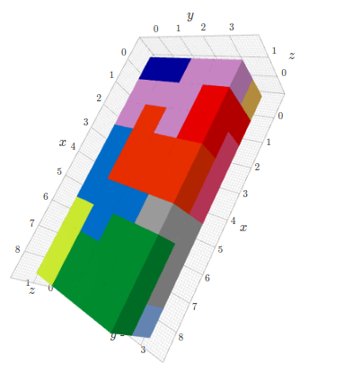

# Dogpiler

Recursive brute-force solver for the game [Dogpile](https://www.brainwright.com/products/display/8310).

Also exploring Python type hints.

3D visualization with [k3d](https://github.com/K3D-tools/K3D-jupyter).

